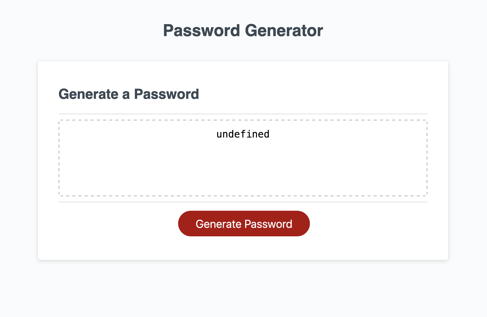

# Random Password Generator

## Building a Password Generator

The purpose of this project is to created a random password generator. Developing this project demonstrates our programming skills.
This project was developed with javascript. It was important that the random password generator worked. I learnt that even if a project was pseudo coded before hand; it does not guarantee that everything was considered and to be open to some "trail and error".  

The following is an image of the password generator.
 

## Installation

N/A

## Usage

To use the password generator, simply click the following link: https://gah-mewbittik.github.io/Random-Password-Generator/
From there you will be able view the Random Password Generator and simply click the "Generate Password" button. Then a prompt window will display asking you
to select the number of characters you would like your password to be(minimum of 8 characters and maximum of 128). After that you are asked for questions, and they
are if you would like to have lowercase, uppercase, numbers, and special characters. 

## Credits

N/A

## License

Please refer to the LICENSE in the repo.
